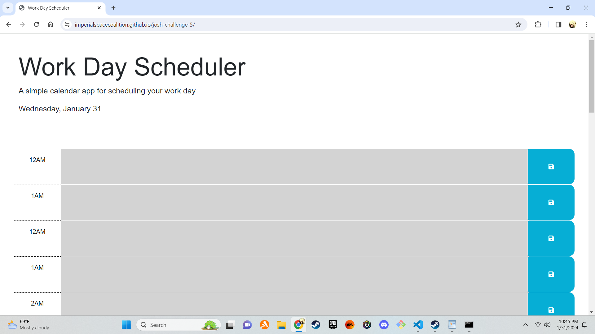

# josh-challenge-5

# Work Day Scheduler

## Description

Work Day Scheduler is a simple calendar app designed to help you schedule your work day effectively. It provides time blocks for each hour of the day, allowing you to add and save tasks for specific hours.

## Features

- **Dynamic Time Blocks:** The scheduler dynamically generates time blocks for the entire 24-hour day, providing a comprehensive view of your schedule.
- **Real-time Styling:** Time blocks are color-coded based on whether they are in the past, present, or future, providing a quick visual reference.
- **User Input Storage:** Save your task descriptions for each hour, and the scheduler will store them in the local storage of your browser.
- **Current Date Display:** The current date is prominently displayed in the header, keeping you informed about the day.

## Getting Started

1. follow the link to the deployed application here: https://imperialspacecoalition.github.io/josh-challenge-5/

## Usage

1. Each time block represents an hour of the day.
2. Type your task or notes in the textarea within the desired time block.
3. Click the save button to store your input locally.
4. Time blocks are color-coded:
    - Past: Gray background
    - Present: Red background
    - Future: Green background

## Technologies Used

- HTML
- CSS
- JavaScript
- [jQuery](https://jquery.com/)
- [Bootstrap](https://getbootstrap.com/)
- [Font Awesome](https://fontawesome.com/)
- [Day.js](https://day.js.org/)

## Original Author and Source

- Original Author: Xandromus
- Source Code: This project is adapted from the coding bootcamp repository.

